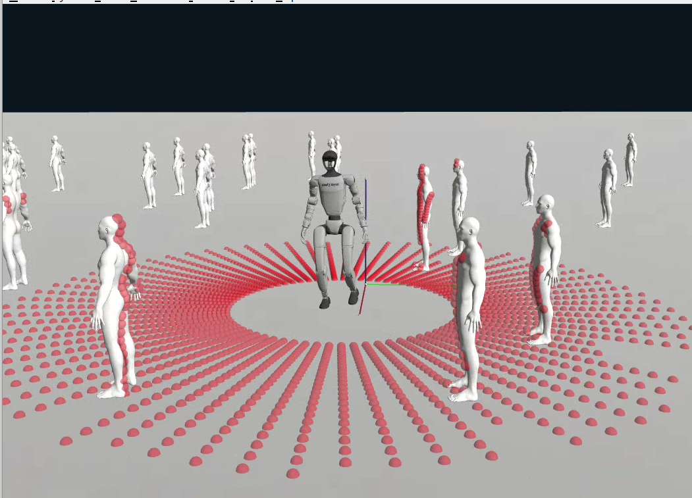

# SafeHumanoidsPolicy

End-to-End Humanoid Robot Safe and Comfortable Locomotion Policy official code and other material.



## Overview

This project implements an end-to-end policy for safe and comfortable humanoid robot locomotion using the G1 humanoid robot with 29 degrees of freedom. The policy is trained using reinforcement learning and can be deployed in simulation environments using the Genesis physics engine.

## Features

- **G1 Humanoid Robot Support**: Full implementation for G1 robot with 29-DOF including hands
- **Genesis Physics Engine**: Simulation using the Genesis physics engine for realistic physics
- **Sim2Sim Transfer**: Easy transfer of trained policies between different simulation environments
- **2D LiDAR Sensor**: Integrated 2D ray-casting sensor for environment perception
- **IMU Sensor Support**: IMU sensor integration for orientation and velocity estimation
- **Modular Design**: Clean separation of robot configuration, sensors, and environment logic

## Project Structure

```
SafeHumanoidsPolicy/
├── sim2sim.py              # Main sim2sim evaluation script
├── requirements.txt        # Python dependencies
├── assets/                 # Robot assets and policies
│   ├── policy.jit         # Trained policy (PyTorch JIT)
│   ├── g1_new/            # G1 robot URDF and meshes
│   ├── humanoid/          # Humanoid robot assets
│   └── resources/         # Additional resources
├── envs/                  # Environment configurations
│   ├── base_task.py       # Base task implementation
│   ├── g1_with_hand_robot.py  # G1 robot environment
│   ├── g1_with_inspire_config.py  # G1 configuration
│   ├── legged_robot_config.py     # Base robot config
│   └── base_config.py     # Base configuration
├── sensors/               # Sensor implementations
│   ├── base_sensor.py     # Base sensor class
│   ├── imu_sensor.py      # IMU sensor
│   └── warp/              # Warp-based sensor kernels
├── mesh/                  # USD mesh files for visualization
└── utils/                 # Utility functions
    └── utils.py           # Helper utilities
```

## Requirements

- Python 3.9+
- CUDA-compatible GPU (recommended)
- Genesis physics engine
- PyTorch 2.5.1+
- See `requirements.txt` for full list of dependencies

## Installation

1. Clone the repository:
```bash
git clone https://github.com/aCodeDog/SafeHumanoidsPolicy.git
cd SafeHumanoidsPolicy
```

2. Create a conda environment:
```bash
conda create -n genesis_gym python=3.9
conda activate genesis_gym
```

3. Install dependencies:
```bash
pip install -r requirements.txt
```

4. Install Genesis:
```bash
pip install genesis-world==0.2.1
```

## Usage

### Running Sim2Sim Evaluation

To run the trained policy in the Genesis simulator:

```bash
python sim2sim.py
```

This will:
1. Load the G1 robot with hand configuration
2. Load the trained policy from `assets/policy.jit`
3. Run the simulation with the policy controlling the robot
4. Display the robot walking in the Genesis viewer

### Configuration

The robot configuration can be modified in `envs/g1_with_inspire_config.py`:

- **Joint angles**: Modify `default_joint_angles` to change the default pose
- **Control parameters**: Adjust PD gains in `control.stiffness` and `control.damping`
- **Command ranges**: Set desired velocities in `commands.ranges`
- **Sensor settings**: Enable/disable sensors in `sensor_config`

### Policy Training

The policy was trained using the Genesis Legged Gym framework (see requirements.txt for the fork used). The observation space includes:
- Base orientation and angular velocity (12 dims)
- Joint positions and velocities (58 dims)
- 2D LiDAR scans (225 dims)

Action space: 29-dimensional continuous actions for joint position control

## Robot Specifications

### G1 Robot Configuration

- **DOF**: 29 (legs: 12, waist: 3, arms: 14)
- **Base Height**: 0.77m
- **Control**: Position control with PD gains
- **Action Scale**: 0.5
- **Decimation**: 4 (control frequency = sim frequency / 4)

### Joint Configuration

The robot includes:
- Hip joints (pitch, roll, yaw) for both legs
- Knee joints
- Ankle joints (pitch, roll)
- Waist joints (yaw, roll, pitch)
- Shoulder joints (pitch, roll, yaw)
- Elbow joints
- Wrist joints (roll, pitch, yaw)

## Sensors

### 2D LiDAR
- **Range**: 0.1m to 6.0m
- **Field of View**: Configurable theta range
- **Resolution**: Configurable theta step
- **Features**: Supports illusion mode for noise simulation

### IMU
- Provides base orientation and angular velocity
- Used for state estimation

## License

[Specify your license here]

## Citation

If you use this code in your research, please cite:

```bibtex
[Add citation information here]
```

## Contributing

Contributions are welcome! Please feel free to submit a Pull Request.

## Contact

For questions or issues, please open an issue on GitHub or contact the maintainers.

## Acknowledgments

- Genesis physics engine team
- G1 humanoid robot developers
- RSL RL library for reinforcement learning
- Genesis Legged Gym framework
